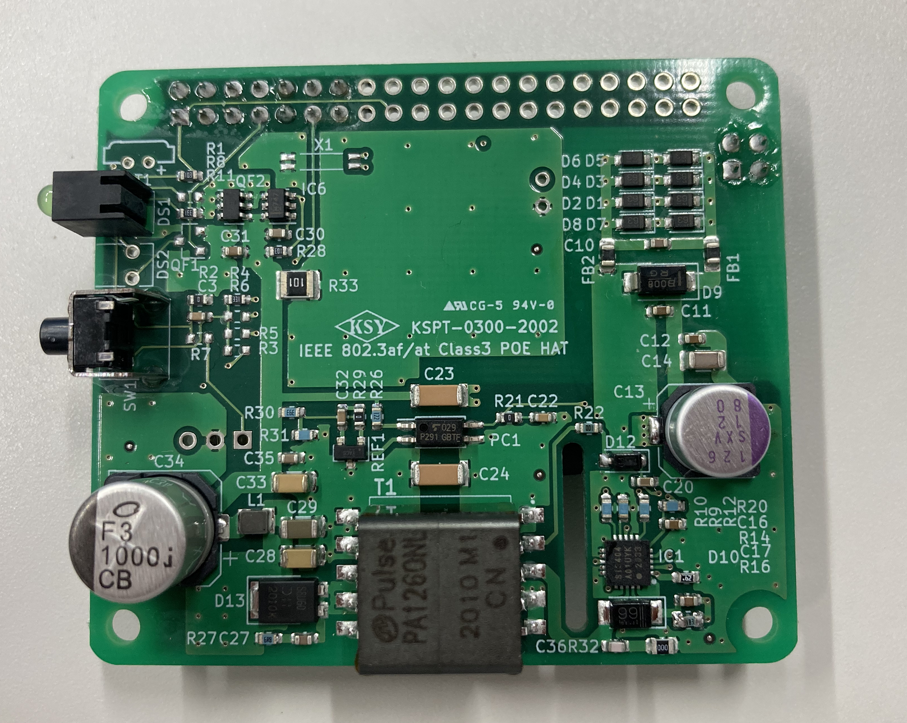

# KSY PoE HAT（開発中）

## １．	概要
KSY PoE HATはRaspberry Piオプションの標準仕様 HATに準拠したPoEモジュールです。
本製品によりRaspberry Pi 3B+およびRaspberry Pi 4BにPoE機能を追加することができます。
PoEを利用することによりRaspberry Piをイーサネットで給電できるため、電源用のアダプタ､USB等のケーブル類が不要になります。 

 
※写真は開発中の物です。
 
## ２．	製品仕様
・PoE規格：IEEE 802.3af PoE PD、IEEE 802.3at Type 1 Class 3 PD	Alternative A/Alternative B   
・入力：    37V～57V Class 3 device (12.95W)   
Raspberry Pi PoE専用ピン（2×2 2.54mmピッチ）   
・出力：    5V 2.5A(Max)     
Raspberry Pi GPIO ピン（2×20 2.54mmピッチ ）   

動作温度範囲： -25℃～55℃ 結露なきこと ※   
※但しRaspberry Piの動作温度範囲に制限されます  
Raspberry Pi 3B+ 動作温度範囲0～50℃   
Raspberry Pi 4	動作温度範囲0～50℃   
外形：　56mm x 65mm   
 
・RoHS指令準拠 
・電源LED、スイッチ（アクティブLo）付き 
・Raspberry Pi 側からの逆流防⽌回路付き(30V) 
 
・逆流防止回路 
理想ダイオードコントローラを利用した耐圧30Ｖの低Vfの逆流防止回路です(Raspberry Piの５Ｖ電源入力の絶対最大定格は６Ｖです)。

・LED DS1 
Raspberry Piの5V電源供給状態のモニタ用LEDです。

・スイッチ SW1 
Raspberry PiのGPIO17に接続されているスイッチです。

 

## ３．	インターフェイス仕様

### （１）	GPIOコネクタ仕様
40ピン中14ピンのみ実装 

| ピン番号 | I/O | 信号名 |	内容 |
|:-------|:-------|:-------|:-------|
| 1	| Power	| 3V3 Power	| GPIO/SW プルアップ電源
| 2	| Power	| 5V Power	| 電源供給
| 3	| I/O	| GPIO2_I2C_SDA1	| 未使用
| 4	| Power	| 5V Power	| 電源供給
| 5	| I/O	| GPIO3_I2C_SCL1	| 未使用
| 6	| GND	| GND	| GND
| 7	| I/O	| GPIO4_LED	| 未使用
| 8	| I/O	| GPIO14_TxD	| 未使用
| 9	| GND	| GND	| GND
| 10 | 	I/O	| GPIO15_RxD	| 未使用
| 11 | 	I	| GPIO17	| タクタイルスイッチ（アクティブLo）
| 12 | 	I/O	| GPIO18_PCM_CLK	| 未使用
| 13 | 	I/O	| GPIO27	| 未使用
| 14 | 	GND	| GND	| GND
| 15-40 | I/O	| 	未実装  | 

### （２）	PoE HAT用拡張ピンヘッダ仕様 
| ピン番号 | I/O | 信号名 |	内容 |
|:-------|:-------|:-------|:-------|
| 1	| Power	| TR1_TAP | PoE | 
| 2	| Power	| TR0_TAP | PoE | 
| 3	| Power	| TR3_TAP | PoE | 
| 4	| Power	| TR2_TAP | PoE | 
   
 
 

##  ４．	使用方法   
Raspberry Piの電源が切れていることを確認し、PoE HAT用拡張ピンヘッダおよびGPIOコネクタを接続して下さい。付属のビスでRaspberry Pi本体と確実に固定して下さい。   
   
 
 

## ５．	使用上の注意    

・本製品を利用するためには、Raspberry Pi本体と別途802.3af、802.3at準拠のPoEインジェクタ、PoE対応スイッチ等が必要です。   

・使用するLANケーブルはCat5e以上の物を使用して下さい。   

・電源供給状態でLANケーブルを脱着しないで下さい。火花が発生し、感電や火災の危険性があります。  

・PSEはClass 0 (15.4W)以上の供給能力のある物を使用して下さい。   

・本製品は、使用中、直後に高温になる場合があります。取り扱いには十分に注意して下さい。 
  
・
---

## ライセンス
このライブラリはMITライセンスで配布します。 MITライセンスの詳細はLICENSEを参照ください。

[MIT](./LICENSE "LICENCE")

## Author
  
[KSY Co., Ltd.](https://github.com/KSY-IC)